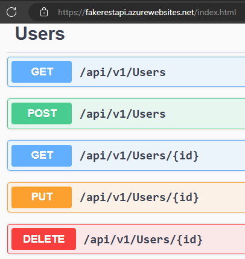

# Notes

## Add solution and test project

```pwsh
dotnet new sln --name FakeRestApiTests
dotnet new nunit --name FakeRestApiTests --output FakeRestApiTests
dotnet sln .\FakeRestApiTests.sln add .\FakeRestApiTests\FakeRestApiTests.csproj
```

## Add RestSharp, FluentAssertions, Bogus and Verify packages

I'm going to use all of these packages. I check for the latest .NET 8 compatible versions and find:

| Documentation | GitHub | Nuget Package|
|:----------------------------------------------------------|:----------------------------------------------------------|:-----------------------------------------------------|
|https://restsharp.dev/                                     |https://github.com/restsharp/RestSharp/releases/tag/112.0.0|https://www.nuget.org/packages/RestSharp/112.0.0      |
|https://fluentassertions.com/                              |https://github.com/fluentassertions/fluentassertions       |https://www.nuget.org/packages/FluentAssertions/6.12.1|
|https://github.com/bchavez/Bogus/blob/v35.6.1/README.md    |https://github.com/bchavez/Bogus/releases/tag/v35.6.1      |https://www.nuget.org/packages/Bogus/35.6.1           |
|https://github.com/VerifyTests/Verify/blob/26.4.4/readme.md|https://github.com/VerifyTests/Verify/releases/tag/26.4.4  |https://www.nuget.org/packages/Verify.NUnit/26.4.4    |

```csharp
dotnet add .\FakeRestApiTests\FakeRestApiTests.csproj package RestSharp --version 112.0.0
dotnet add .\FakeRestApiTests\FakeRestApiTests.csproj package FluentAssertions --version 6.12.1
dotnet add .\FakeRestApiTests\FakeRestApiTests.csproj package Bogus --version 35.6.1
```

Note that adding `Verify.NUnit --version 26.4.4` with 

```csharp
dotnet add .\FakeRestApiTests\FakeRestApiTests.csproj package Verify.NUnit --version 26.4.4
```

led to this error:

> error: NU1605: Warning As Error: Detected package downgrade: NUnit from 4.2.2 to 3.14.0. Reference the package directly from the project to select a different version. 
> error:  FakeRestApiTests -> Verify.NUnit 26.4.4 -> NUnit (>= 4.2.2)
> error:  FakeRestApiTests -> NUnit (>= 3.14.0)

On looking at .\FakeRestApiTests\FakeRestApiTests.csproj I noticed <PackageReference Include="NUnit" Version="3.14.0" />. NUnit needs to be on 4.2.2. 

I update the package reference to <PackageReference Include="NUnit" Version="4.2.2" /> and try install verify again. It succeeds.

## Using Swagger to discover what to automate

The base url https://fakerestapi.azurewebsites.net resolves to https://fakerestapi.azurewebsites.net/index.html in the browser. That gets to a Swagger UI. It's fantastic to use.

First thing to notice is how each of the resources lie in "/api/v1". This means calling the endpoint will need.

Second thing is to set expectations on what this API enables.



An exploratory session reveals a few things.

1. Calling `GET /api/v1/users` returns a list of users in JSON. 
2. Calling `POST /api/v1/users` returns a user as defined in the request body. In fact it returns precisely the user you added in the request body.
3. Calling `GET /api/v1/users/{id}` returns a user so long as `id` is an integer between 1 and 10 (inclusive of bounds). Else it returns a not found response.
4. Calling `PUT /api/v1/users/{id}` returns a user as defined in the request body. In fact it returns precisely the user you added in the request body. It doesn't matter what `id` you put in the path, the `id` defined in the body is what gets returned.
5. Calling `DELETE /api/v1/users/{id}` an empty response body for any integer passed in.
6. For all of the above calls the response code is 200 unless it's the error scenario.
7. The data is not persisted. You can't add a record with `POST` or update a record with `PUT` or delete a record with `DELETE`, and then call `GET /api/v1/users` expecting your changes to be persisted.
8. Since the request body and response body are identical, it makes sense to define a json schema for them.

### About JSON schema

https://json-schema.org/understanding-json-schema/about describes what JSON schemas do. In brief, it allows data in JSON to be validated for what is needed. In this scenario a user looks like 

```json
{
  "id": 1,
  "userName": "User 1",
  "password": "Password1"
}
```

* It's clear that for the value for the "id" key must be an integer
* The values for "userName" and "password" must be strings.
* Everything in the braces must be of some type. In JSON it's called an object. In other languages you might see it as a dictionary.

A quick chatgpt analysis for this user suggests the schema to be 

```json
{
  "$schema": "http://json-schema.org/draft-07/schema#",
  "type": "object",
  "properties": {
    "id": {
      "type": "integer"
    },
    "userName": {
      "type": "string",
      "minLength": 1
    },
    "password": {
      "type": "string",
      "minLength": 1
    }
  },
  "required": ["id", "userName", "password"],
  "additionalProperties": false
}
```

What this guess by ChatGpt suggests is precisely what was surmised at a glance.

It may be useful to look at JSON schemas a bit more and how they work. https://json-schema.org/ provides all the documentation needed. From a testing perspective it's good to know the rules for what is and isn't acceptable in the request body ahead of time. But for now, the guesswork is the test oracle that gives what's enough.

## Why bother with looking at the user schema?

It's going to be useful. The idea for the testing is to deserialize the request, put it in memory, then test whether the values passed in are the same as the expected ones. For that it's going to be useful to define a plain old c# object (POCO) in a model. This allows to pinpoint which of the values in the whole JSON text is a problematic one. It's much easier to use a POCO to do the pinpointing than it is to look at the whole request.

This idea can be extended to making a POCO for an error response (which is already identified as something that can happen from trying to get a user with an id outside the range 1 and 10 (inclusive)).

```json
{
  "type": "https://tools.ietf.org/html/rfc7231#section-6.5.4",
  "title": "Not Found",
  "status": 404,
  "traceId": "00-bdbc2a8d6040c04a90b70ec1e2da4d3c-3cf5bd08149fc942-00"
}
```

For this error response, here's what I see:

1. https://tools.ietf.org/html/rfc7231#section-6.5.4 points to the definition of 404 Not Found. That is what "type" returns.
2. "title" returns "Not Found"
3. "status" returns 404
4. "traceId" returns something I don't know much about. I'm not sure how the server sets that.

# Test Design

TODO: define what test design is. Explain why it is that I went through all this manual work.

I know I want to:

1. Use `RestSharp` to enhance `HttpClient`
2. Define `UserModel` to help with serializing and deserializing JSON requests and responses.
3. Use `Bogus` to pass in bogus data to assert that indeed I am getting the requests and responses as needed.
4. Use `NUnit`'s `Range` and `Random` attributes
5. Use `Verify` to assert that the error response message is essentially the same by scrubbing the traceId
6. Print to console the inputs and outputs so that the randomization is evident in the test run.

What I want to do is articulate why I want to approach the tests with this implementation. Why am I wanting to implement this? What is the implicit test design in my head?